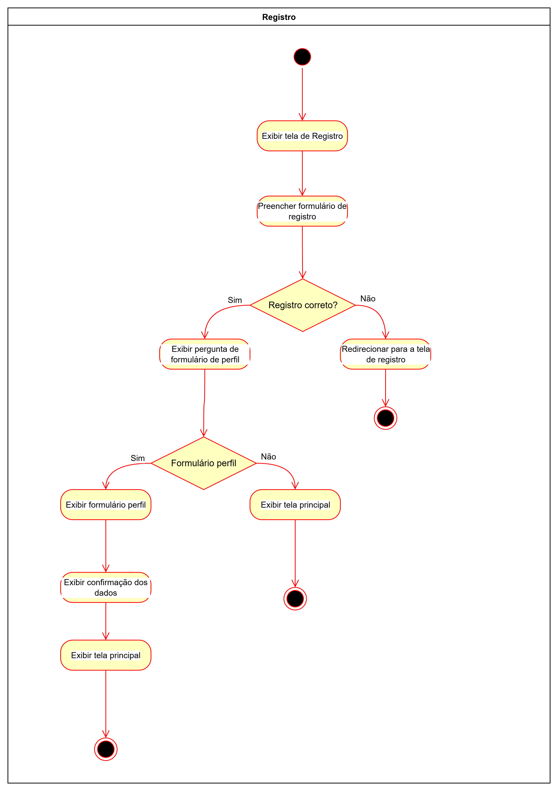
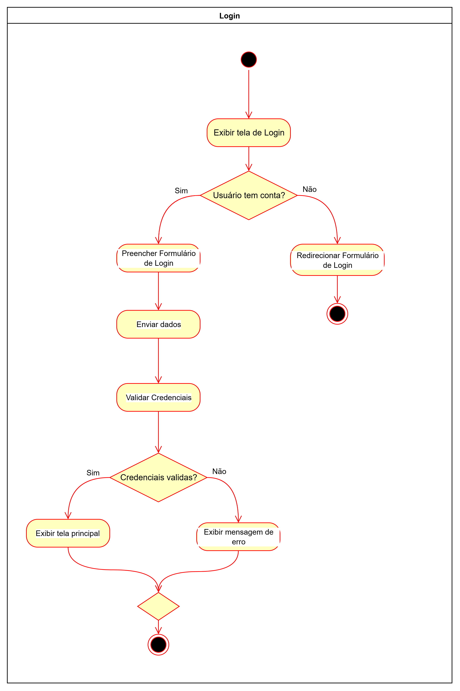
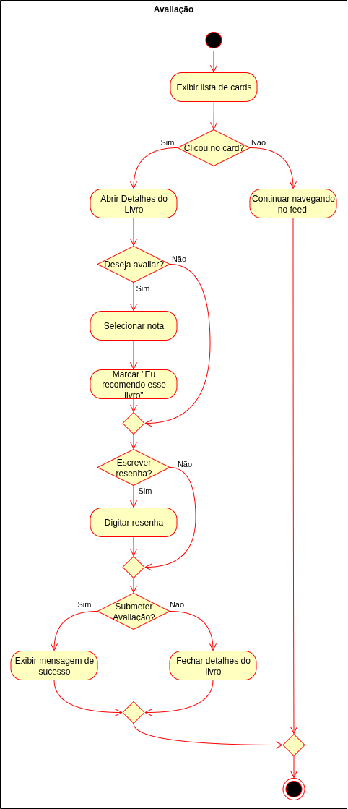
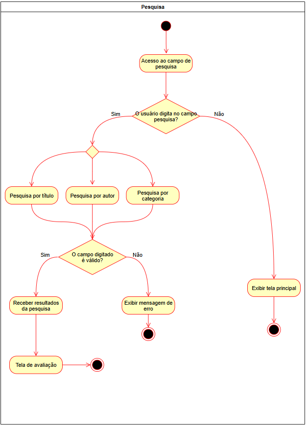
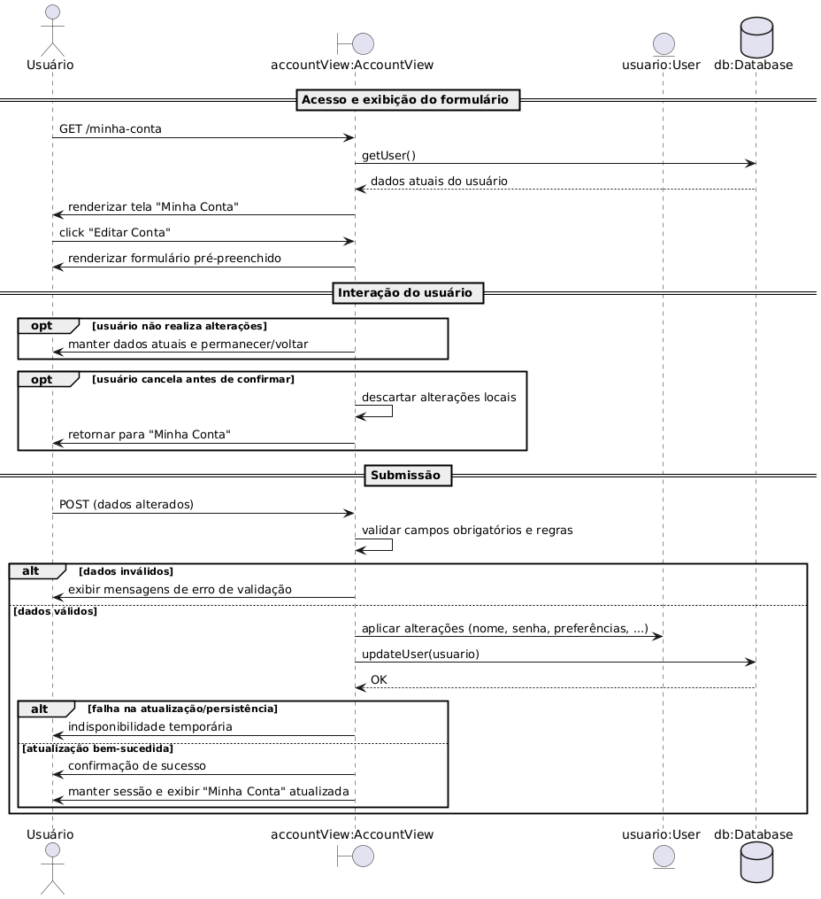
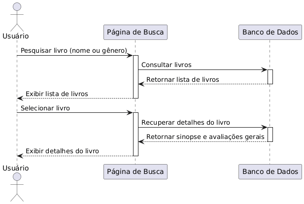

# 4.1.2. Visualização do Processo

## Introdução

Segundo o RUP, a visualização de processo lida com os aspectos dinâmicos do sistema, descreve processos de sistema e como eles se comunicam e enfatiza o comportamento do sistema durante sua execução, descrevendo diferentes atividades de sistema. Diagramas de sequência e de atividades são utilizados para a visualização de processo.

## Visão Geral

O **EuRecomendo** é um sistema que permite aos usuários descobrir novos livros através de recomendações personalizadas baseadas em algoritmos de machine learning. O sistema analisa o histórico de leituras, avaliações e preferências dos usuários para gerar sugestões relevantes.

## Diagramas

Esta seção apresenta os diagramas que ilustram o comportamento dinâmico do sistema EuRecomendo, incluindo diagramas de atividades e diagramas de sequência para os principais fluxos de negócio.

### Diagrama de Atividades

O Diagrama de Atividades é utilizado para modelar aspectos dinâmicos de um sistema e tem como foco o fluxo de controle de uma atividade para a outra.

Dentro do projeto EuRecomendo, foram identificados os seguintes fluxos principais:

#### 1. Fluxo de Geração de Recomendações

**Descrição**: Este fluxo ilustra o processo completo de geração de recomendações, desde a solicitação do usuário até a entrega das sugestões personalizadas. O sistema utiliza cache para otimizar performance e processamento assíncrono para não bloquear a interface do usuário.

#### 2. Fluxo de Avaliação de Livro

**Descrição**: Fluxo que demonstra o processo de avaliação de um livro pelo usuário, incluindo validação de dados e atualização assíncrona de estatísticas.

#### 3. Fluxo de Busca de Livros

**Descrição**: Processo de busca de livros no catálogo com suporte a múltiplos critérios e sugestões inteligentes.

#### Diagramas de Atividades reutilizados (Entrega 02)

  

Figura 1 – Fluxo de registro de usuário reutilizado da Entrega 02.

  

Figura 2 – Fluxo de login reutilizado da Entrega 02.

  

Figura 3 – Fluxo de avaliação de livro (Entrega 02).

  

Figura 4 – Fluxo de busca/pesquisa de livros (Entrega 02).

### Diagramas de Sequência

O Diagrama de Sequência é utilizado para representar a interação entre objetos em um determinado cenário de uso do sistema, mostrando a ordem em que as mensagens são trocadas e como os objetos colaboram para realizar uma funcionalidade específica.

#### 1. Criar Avaliação de Livro

**Descrição**: Sequência de interações para criação de uma avaliação de livro, incluindo persistência e disparo de tarefa assíncrona para atualização de estatísticas.

#### 2. Gerar Recomendações

**Descrição**: Sequência completa de geração de recomendações, mostrando a orquestração entre diferentes algoritmos e o uso de cache para otimização.

#### 3. Autenticação de Usuário (Login)

**Descrição**: Processo de autenticação com geração de token JWT para acesso stateless à API.

#### 4. Adicionar Livro à Biblioteca Pessoal

**Descrição**: Adição de livro à biblioteca pessoal com disparo de atualização de recomendações.

#### 5. Buscar Livros

**Descrição**: Busca de livros com ranking por relevância.

#### Diagramas de Sequência reutilizados (Entrega 02)

  

Figura 5 – Sequência para criar conta (Entrega 02).

  

Figura 6 – Sequência para editar conta (Entrega 02).

  

Figura 7 – Sequência para pesquisar livro (Entrega 02).

## Considerações sobre Concorrência

### Processamento Assíncrono

O sistema EuRecomendo utiliza **Celery** para processamento assíncrono de tarefas que podem ser demoradas:

1. **Geração de Recomendações**: Algoritmos de ML podem levar segundos para processar
2. **Atualização de Estatísticas**: Recalcular ratings médios após novas avaliações
3. **Envio de Notificações**: Emails e notificações push não bloqueiam requisições
4. **Importação em Lote**: Processamento de arquivos CSV com milhares de livros

### Gerenciamento de Cache

**Redis** é utilizado para cache de:
- Recomendações geradas (TTL: 24 horas)
- Resultados de buscas frequentes (TTL: 1 hora)
- Sessões de usuário (TTL: 7 dias)
- Dados de livros populares (TTL: 6 horas)

### Estratégia de Invalidação

- **Time-based**: Cache expira após período definido
- **Event-based**: Invalidação ao adicionar/remover livros da biblioteca
- **Manual**: Administradores podem forçar regeneração

## Quadro de Participações

| **Membro da equipe** | **Função** |
| :------------- | :--------- |
| Pedro Braga ([@Stain19](https://github.com/Stain19)) | Desenvolvimento completo da Visualização de Processo com diagramas de atividades e sequência |

## Referências

> 1. FOWLER, Martin. UML Distilled: A Brief Guide to the Standard Object Modeling Language. 3rd ed. Addison-Wesley, 2003.

## Histórico de Versões

| **Data**       | **Versão** | **Descrição**                         | **Autor**                                      | **Revisor**                                      | **Data da Revisão** |
| :--------: | :----: | :-------------------------------- | :----------------------------------------: | :----------------------------------------: | :-------------: |
| 21/11/2025 |  `1.0`   | Criação da Visualização de Processo | Pedro Braga ([@Stain19](https://github.com/Stain19)) | - |   -    |
