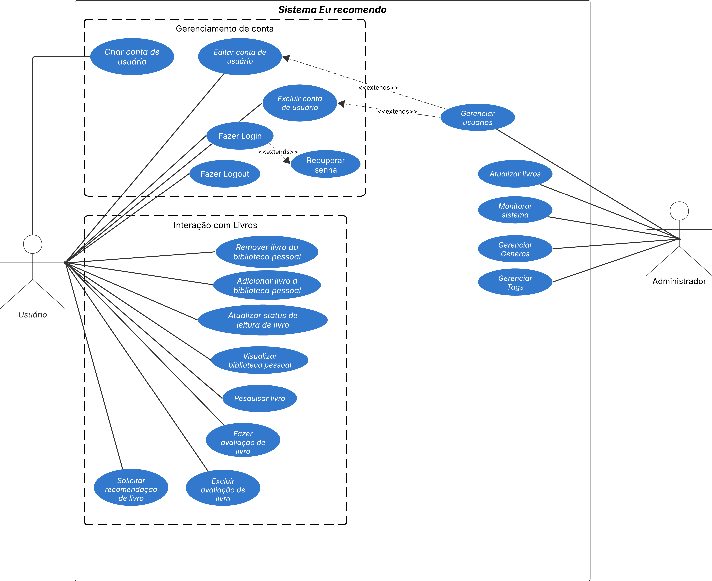

# Visualização de Casos de Uso

## Introdução

Este documento tem como objetivo descrever a arquitetura do sistema **EuRecomendo**, com foco nos casos de uso desenvolvidos para o projeto. Com isso, é possível fornecer uma visão detalhada das interações entre os atores e o sistema, de forma que são destacados os principais fluxos e funcionalidades que compõem este sistema.

## Visão Geral

O **EuRecomendo** é um sistema que permite aos usuários descobrir novos livros através de recomendações personalizadas baseadas em algoritmos de machine learning. O sistema analisa o histórico de leituras, avaliações e preferências dos usuários para gerar sugestões relevantes e personalizadas.

## Diagrama de Casos de Uso

Ao modelar os casos de uso é possível ter uma melhor noção de como serão as funcionalidades do sistema que será desenvolvido. O diagrama a seguir ilustra os casos de uso e seus relacionamentos no contexto do sistema EuRecomendo.

  

Figura 1 – Diagrama de casos de uso consolidado da Entrega 02. Esta entrega prioriza o subconjunto de casos centrais descritos a seguir.

### Principais Atores

* **Usuário Leitor**: Representa um leitor que utiliza o sistema para descobrir novos livros, avaliar leituras e gerenciar sua biblioteca pessoal.
* **Administrador**: Representa um usuário com privilégios administrativos que gerencia o catálogo de livros e modera conteúdo.
* **Sistema de Recomendação**: Ator interno que processa dados e gera recomendações personalizadas de forma assíncrona.

### Principais Casos de Uso

#### UC01 - Cadastrar Usuário
**Ator Principal**: Usuário Leitor  
**Objetivo**: Criar uma nova conta no sistema  
**Pré-condições**: Nenhuma  
**Pós-condições**: Usuário cadastrado e perfil criado

**Fluxo Principal**:
1. Usuário acessa a página de cadastro
2. Sistema exibe formulário de registro
3. Usuário preenche dados (nome, email, senha)
4. Sistema valida dados
5. Sistema cria conta e perfil inicial
6. Sistema envia email de confirmação
7. Usuário confirma email
8. Sistema ativa a conta

**Fluxos Alternativos**:
- **FA01**: Email já cadastrado → Sistema informa erro
- **FA02**: Senha fraca → Sistema solicita senha mais forte
- **FA03**: Dados inválidos → Sistema exibe mensagens de erro

#### UC02 - Fazer Login
**Ator Principal**: Usuário Leitor  
**Objetivo**: Autenticar-se no sistema  
**Pré-condições**: Usuário cadastrado e conta ativa  
**Pós-condições**: Usuário autenticado com token JWT

**Fluxo Principal**:
1. Usuário acessa página de login
2. Sistema exibe formulário
3. Usuário informa email e senha
4. Sistema valida credenciais
5. Sistema gera token JWT
6. Sistema retorna token ao usuário
7. Usuário é redirecionado para página inicial

**Fluxos Alternativos**:
- **FA01**: Credenciais inválidas → Sistema informa erro
- **FA02**: Conta inativa → Sistema solicita ativação
- **FA03**: Múltiplas tentativas falhas → Sistema bloqueia temporariamente

#### UC03 - Buscar Livros
**Ator Principal**: Usuário Leitor  
**Objetivo**: Encontrar livros no catálogo  
**Pré-condições**: Usuário autenticado  
**Pós-condições**: Lista de livros exibida

**Fluxo Principal**:
1. Usuário acessa funcionalidade de busca
2. Sistema exibe interface de busca
3. Usuário informa critérios (título, autor, gênero, ISBN)
4. Sistema processa busca
5. Sistema retorna resultados ordenados por relevância
6. Usuário visualiza lista de livros

**Fluxos Alternativos**:
- **FA01**: Nenhum resultado encontrado → Sistema sugere termos similares
- **FA02**: Busca vazia → Sistema exibe livros populares
- **FA03**: Aplicar filtros → Sistema refina resultados

#### UC04 - Avaliar Livro (<<include>> Validar Avaliação)
**Ator Principal**: Usuário Leitor  
**Objetivo**: Avaliar um livro lido  
**Pré-condições**: Usuário autenticado  
**Pós-condições**: Avaliação registrada e estatísticas atualizadas

**Fluxo Principal**:
1. Usuário seleciona livro
2. Sistema exibe detalhes do livro
3. Usuário clica em "Avaliar"
4. Sistema exibe formulário de avaliação
5. Usuário atribui nota (1-5 estrelas)
6. Usuário escreve comentário (opcional)
7. Sistema valida avaliação (<<include>> UC04.1)
8. Sistema salva avaliação
9. Sistema atualiza estatísticas do livro
10. Sistema confirma sucesso

**UC04.1 - Validar Avaliação** (Incluído):
1. Sistema verifica se nota está entre 1-5
2. Sistema verifica se comentário não contém spam
3. Sistema verifica se usuário não avaliou anteriormente
4. Sistema retorna validação

**Fluxos Alternativos**:
- **FA01**: Avaliação duplicada → Sistema pergunta se deseja atualizar
- **FA02**: Comentário com spam → Sistema rejeita e solicita revisão
- **FA03**: Nota inválida → Sistema solicita correção

#### UC05 - Receber Recomendações
**Ator Principal**: Usuário Leitor  
**Ator Secundário**: Sistema de Recomendação  
**Objetivo**: Obter sugestões personalizadas de livros  
**Pré-condições**: Usuário autenticado com histórico de leituras  
**Pós-condições**: Lista de recomendações gerada

**Fluxo Principal**:
1. Usuário acessa página de recomendações
2. Sistema verifica se há recomendações em cache
3. Se não houver, Sistema dispara geração assíncrona
4. Sistema de Recomendação analisa perfil do usuário
5. Sistema de Recomendação calcula similaridades
6. Sistema de Recomendação gera lista de recomendações
7. Sistema armazena recomendações em cache
8. Sistema exibe recomendações ao usuário
9. Usuário visualiza livros recomendados com scores

**Fluxos Alternativos**:
- **FA01**: Usuário sem histórico → Sistema exibe livros populares
- **FA02**: Recomendações em cache → Sistema retorna imediatamente
- **FA03**: Processamento em andamento → Sistema exibe indicador de progresso

#### UC06 - Gerenciar Biblioteca Pessoal
**Ator Principal**: Usuário Leitor  
**Objetivo**: Organizar livros em biblioteca pessoal  
**Pré-condições**: Usuário autenticado  
**Pós-condições**: Biblioteca atualizada

**Fluxo Principal**:
1. Usuário acessa biblioteca pessoal
2. Sistema exibe livros organizados por status
3. Usuário seleciona livro
4. Usuário escolhe ação (adicionar, remover, atualizar status)
5. Sistema processa ação
6. Sistema atualiza biblioteca
7. Sistema confirma alteração

**Fluxos Alternativos**:
- **FA01**: Adicionar livro → Sistema adiciona com status "Quero Ler"
- **FA02**: Marcar como lido → Sistema solicita avaliação
- **FA03**: Atualizar progresso → Sistema salva percentual de leitura

#### UC07 - Visualizar Histórico de Leituras
**Ator Principal**: Usuário Leitor  
**Objetivo**: Consultar livros lidos anteriormente  
**Pré-condições**: Usuário autenticado  
**Pós-condições**: Histórico exibido

**Fluxo Principal**:
1. Usuário acessa histórico
2. Sistema recupera livros com status "Lido"
3. Sistema ordena por data de conclusão
4. Sistema calcula estatísticas (total lido, gêneros favoritos)
5. Sistema exibe histórico com estatísticas
6. Usuário visualiza informações

**Fluxos Alternativos**:
- **FA01**: Filtrar por período → Sistema aplica filtro
- **FA02**: Filtrar por gênero → Sistema refina resultados
- **FA03**: Exportar dados → Sistema gera arquivo CSV

#### UC08 - Gerenciar Catálogo de Livros
**Ator Principal**: Administrador  
**Objetivo**: Adicionar, editar ou remover livros do catálogo  
**Pré-condições**: Usuário autenticado como administrador  
**Pós-condições**: Catálogo atualizado

**Fluxo Principal**:
1. Administrador acessa painel administrativo
2. Sistema exibe interface de gerenciamento
3. Administrador seleciona ação (criar, editar, deletar)
4. Sistema exibe formulário apropriado
5. Administrador preenche/edita dados do livro
6. Sistema valida informações
7. Sistema salva alterações
8. Sistema confirma sucesso

**Fluxos Alternativos**:
- **FA01**: ISBN duplicado → Sistema informa erro
- **FA02**: Dados incompletos → Sistema solicita preenchimento
- **FA03**: Importar em lote → Sistema processa arquivo CSV

#### UC09 - Moderar Avaliações
**Ator Principal**: Administrador  
**Objetivo**: Revisar e moderar avaliações de usuários  
**Pré-condições**: Usuário autenticado como administrador  
**Pós-condições**: Avaliações moderadas

**Fluxo Principal**:
1. Administrador acessa painel de moderação
2. Sistema exibe avaliações pendentes
3. Administrador seleciona avaliação
4. Sistema exibe detalhes completos
5. Administrador decide (aprovar, rejeitar, editar)
6. Sistema processa decisão
7. Sistema notifica usuário (se rejeitada)
8. Sistema atualiza status da avaliação

**Fluxos Alternativos**:
- **FA01**: Aprovar em lote → Sistema aprova múltiplas avaliações
- **FA02**: Banir usuário → Sistema desativa conta
- **FA03**: Editar conteúdo → Sistema salva versão editada

#### UC10 - Gerar Recomendações (Processamento Assíncrono)
**Ator Principal**: Sistema de Recomendação  
**Objetivo**: Processar dados e gerar recomendações personalizadas  
**Pré-condições**: Dados de usuários e livros disponíveis  
**Pós-condições**: Recomendações geradas e armazenadas

**Fluxo Principal**:
1. Sistema recebe requisição de geração
2. Sistema adiciona tarefa à fila Celery
3. Worker Celery processa tarefa
4. Sistema carrega perfil do usuário
5. Sistema aplica algoritmo colaborativo
6. Sistema aplica algoritmo baseado em conteúdo
7. Sistema combina resultados (híbrido)
8. Sistema calcula scores de confiança
9. Sistema ordena por relevância
10. Sistema armazena recomendações em cache
11. Sistema marca tarefa como concluída

**Fluxos Alternativos**:
- **FA01**: Erro no processamento → Sistema registra log e reprocessa
- **FA02**: Dados insuficientes → Sistema usa fallback (livros populares)
- **FA03**: Cache expirado → Sistema regenera recomendações

## Relacionamentos Entre os Casos de Uso

Os seguintes relacionamentos foram identificados:

### Relacionamentos <<include>>
- **UC04 (Avaliar Livro)** inclui **UC04.1 (Validar Avaliação)**: A validação é parte essencial e obrigatória do processo de avaliação

### Relacionamentos <<extend>>
- **UC03 (Buscar Livros)** pode ser estendido por **Aplicar Filtros Avançados**: Funcionalidade opcional para refinar resultados
- **UC06 (Gerenciar Biblioteca)** pode ser estendido por **Compartilhar Lista**: Funcionalidade opcional para compartilhar listas de leitura

### Relacionamentos de Generalização
- **UC01 (Cadastrar Usuário)** e **UC02 (Fazer Login)** são especializações de **Autenticação**
- **UC08 (Gerenciar Catálogo)** e **UC09 (Moderar Avaliações)** são especializações de **Administração**

## Considerações Finais

Com o diagrama de casos de uso apresentado neste documento é possível ter uma visão geral das principais funcionalidades do sistema EuRecomendo. Servindo como um guia do que deverá ser implementado ao realizar cada um dos casos de uso. Além disso, é importante destacar que mesmo fornecendo uma boa noção de como alguns dos requisitos serão implementados, os outros documentos do DAS também são essenciais para que o projeto seja feito de maneira organizada e coerente com o que está sendo proposto.

## Quadro de Participações

| **Membro da equipe** | **Função** |
| :------------- | :--------- |
| Pedro Braga ([@Stain19](https://github.com/Stain19)) | Desenvolvimento completo da Visualização de Casos de Uso com 10 casos de uso detalhados |

## Referências

> 1. UNIVERSIDADE DE BRASÍLIA (UnB). Arquitetura e Desenho de Software. Disponível em: Aprender3. Acesso em: 21/11/2025.
> 2. FOWLER, Martin. UML Distilled: A Brief Guide to the Standard Object Modeling Language. 3rd ed. Addison-Wesley, 2003.

## Histórico de Versões

| **Data**       | **Versão** | **Descrição**                         | **Autor**                                      | **Revisor**                                      | **Data da Revisão** |
| :--------: | :----: | :-------------------------------- | :----------------------------------------: | :----------------------------------------: | :-------------: |
| 21/11/2025 |  `1.0`   | Criação da Visualização de Casos de Uso | Pedro Braga ([@Stain19](https://github.com/Stain19)) | - |   -    |
