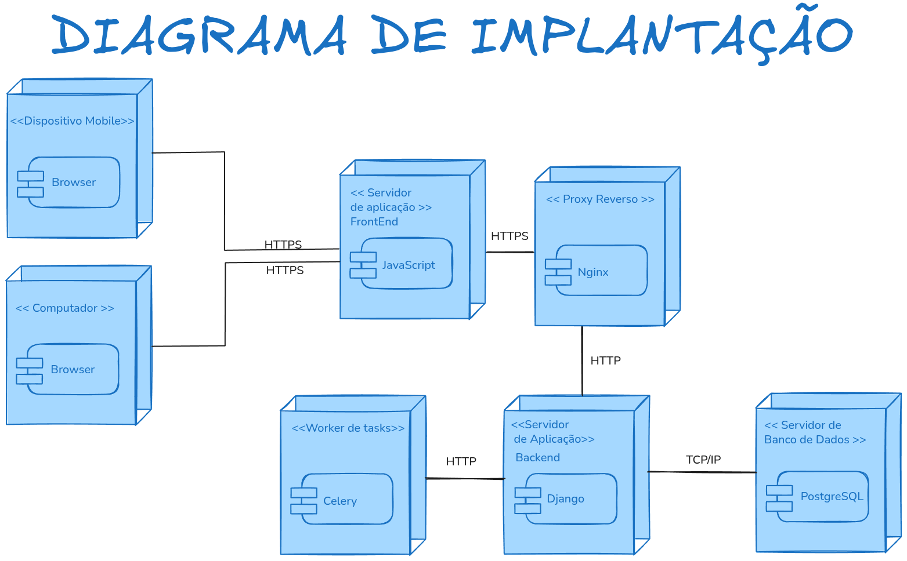

# Visão de Implantação

A Visão de Implantação do **EuRecomendo** apresenta a configuração física de hardware e software na qual o sistema será executado. O objetivo é demonstrar os **nós físicos**, **artefatos**, **componentes lógicos**, e **interconexões de rede** que sustentam o funcionamento do sistema em um ambiente de produção.

## Introdução

Esta seção descreve como os componentes do sistema EuRecomendo são distribuídos em nós de hardware e como eles se comunicam através da rede. A arquitetura de implantação foi projetada para garantir escalabilidade, disponibilidade e performance adequadas.

## Diagrama de Implantação

<p align="center">
  
</p>
<div align="center"><font size="3">Figura 1 – Diagrama de implantação reutilizado da Entrega 02 (Modelagem).</font></div>

## Detalhamento dos Nós

### 1. Dispositivos do Usuário (<device> Navegador Web)

**Descrição:**
Computadores, smartphones ou tablets utilizados pelos usuários para acessar o sistema EuRecomendo.

**Perfis de Usuário:**
* Leitor: Busca livros, recebe recomendações, avalia livros
* Administrador: Gerencia catálogo e modera conteúdo

**Artefatos/Processos Implantados:**
* Interface Web (HTML, CSS, JavaScript)
* Lógica de sessão (armazenamento de tokens JWT)
* Consumo das APIs REST do servidor

**Funções Executadas:**
* Renderização da interface do usuário
* Validação de formulários client-side
* Gerenciamento de estado da aplicação
* Comunicação com API via AJAX/Fetch

**Conexões:**
* Comunicação via **HTTPS** com o Load Balancer

**Requisitos:**
* Navegador moderno (Chrome 90+, Firefox 88+, Safari 14+, Edge 90+)
* JavaScript habilitado
* Conexão à internet

### 2. Load Balancer / Nginx (<server> Reverse Proxy)

**Descrição:**
Servidor de entrada que distribui requisições entre instâncias da aplicação e fornece terminação SSL/TLS.

**Artefatos/Processos Implantados:**
* Nginx (versão 1.21+)
* Certificados SSL/TLS
* Configurações de proxy reverso
* Regras de rate limiting

**Funções Executadas:**
* Terminação SSL/TLS
* Distribuição de carga (load balancing)
* Servir arquivos estáticos
* Compressão gzip
* Rate limiting e proteção DDoS
* Health checks das instâncias backend

**Conexões:**
* **HTTPS** (porta 443) com clientes
* **HTTP** (porta 8000) com Application Server
* **TCP** para health checks

**Configuração Típica:**
```nginx
upstream django_app {
    server app1:8000;
    server app2:8000;
    server app3:8000;
}

server {
    listen 443 ssl http2;
    server_name eurecomendo.com;
    
    ssl_certificate /etc/ssl/certs/eurecomendo.crt;
    ssl_certificate_key /etc/ssl/private/eurecomendo.key;
    
    location / {
        proxy_pass http://django_app;
        proxy_set_header Host $host;
        proxy_set_header X-Real-IP $remote_addr;
    }
    
    location /static/ {
        alias /var/www/static/;
    }
}
```

### 3. Servidor de Aplicação (<server> Django Application Server)

**Descrição:**
Servidor central que hospeda toda a lógica de negócio do EuRecomendo. Pode ser uma máquina dedicada, VM em nuvem ou container Docker.

**Artefatos/Processos Implantados:**

**Módulos Django:**
* **users/** – Gerenciamento de usuários e autenticação
* **profiles/** – Perfis de usuário e preferências
* **books/** – Catálogo de livros
* **reviews/** – Sistema de avaliações
* **recommender/** – Motor de recomendação
* **celery_app/** – Configuração de tarefas assíncronas

**Componentes de Runtime:**
* **Gunicorn** (WSGI Server) - 4 workers
* **Django 4.x** - Framework web
* **Django REST Framework** - API REST
* **djangorestframework-simplejwt** - Autenticação JWT

**Funções Executadas:**
* Processamento de requisições HTTP
* Validação e serialização de dados
* Execução de lógica de negócio
* Autenticação e autorização
* Geração de respostas JSON
* Logging e monitoring

**Conexões:**
* **TCP/IP** seguro com PostgreSQL (porta 5432)
* **TCP/IP** com Redis (porta 6379)
* **HTTP** com Nginx (porta 8000)

**Especificações Recomendadas:**
* CPU: 4 vCPUs
* RAM: 8 GB
* Storage: 50 GB SSD
* OS: Ubuntu 22.04 LTS

**Variáveis de Ambiente:**
```bash
DJANGO_SECRET_KEY=<secret>
DJANGO_DEBUG=False
DATABASE_URL=postgresql://user:pass@db:5432/eurecomendo
REDIS_URL=redis://redis:6379/0
CELERY_BROKER_URL=redis://redis:6379/1
```

### 4. Sistema de Banco de Dados (<database> PostgreSQL)

**Descrição:**
Servidor responsável pela persistência dos dados do sistema. Em produção, pode ser um serviço gerenciado (AWS RDS, Google Cloud SQL, Azure Database).

**Artefatos/Processos Implantados:**
* PostgreSQL 14+ Database Server
* Esquema completo do EuRecomendo:
  - Tabelas: users, profiles, books, reviews, recommendations, user_library
  - Índices otimizados para queries frequentes
  - Constraints e foreign keys
  - Triggers para auditoria

**Funções Executadas:**
* Persistência de dados transacionais
* Execução de queries SQL
* Garantia de integridade referencial (ACID)
* Backup automático
* Replicação (master-slave)

**Conexões:**
* **TCP/IP** (porta 5432) com Application Server
* Apenas o Application Server tem permissão de acesso
* Conexões criptografadas via SSL

**Especificações Recomendadas:**
* CPU: 4 vCPUs
* RAM: 16 GB
* Storage: 200 GB SSD (com auto-scaling)
* Backup: Diário com retenção de 30 dias

**Principais Tabelas:**
```sql
-- Usuários e autenticação
users (id, username, email, password_hash, is_active, date_joined)
profiles (id, user_id, bio, favorite_genres, reading_preferences)

-- Catálogo de livros
books (id, title, author, isbn, genre, publication_year, synopsis)

-- Sistema de avaliações
reviews (id, user_id, book_id, rating, comment, status, created_at)

-- Recomendações
recommendations (id, user_id, book_id, score, algorithm_used, created_at)

-- Biblioteca pessoal
user_library (id, user_id, book_id, status, progress, started_at)
```

### 5. Sistema de Cache e Message Broker (<cache> Redis)

**Descrição:**
Servidor Redis utilizado para cache em memória e como message broker para Celery.

**Artefatos/Processos Implantados:**
* Redis 7.x Server
* Configurações de persistência (RDB + AOF)
* Políticas de eviction (LRU)

**Funções Executadas:**

**Como Cache:**
* Cache de sessões de usuário (TTL: 7 dias)
* Cache de recomendações (TTL: 24 horas)
* Cache de resultados de busca (TTL: 1 hora)
* Cache de dados de livros populares (TTL: 6 horas)

**Como Message Broker:**
* Fila de tarefas Celery
* Armazenamento de resultados de tarefas
* Pub/Sub para notificações em tempo real

**Conexões:**
* **TCP/IP** (porta 6379) com Application Server
* **TCP/IP** (porta 6379) com Celery Workers

**Especificações Recomendadas:**
* CPU: 2 vCPUs
* RAM: 8 GB (principalmente para cache)
* Storage: 20 GB SSD
* Persistência: RDB snapshots + AOF

**Configuração de Cache:**
```python
CACHES = {
    'default': {
        'BACKEND': 'django_redis.cache.RedisCache',
        'LOCATION': 'redis://redis:6379/0',
        'OPTIONS': {
            'CLIENT_CLASS': 'django_redis.client.DefaultClient',
        },
        'KEY_PREFIX': 'eurecomendo',
        'TIMEOUT': 3600,  # 1 hora padrão
    }
}
```

### 6. Celery Workers (<worker> Processamento Assíncrono)

**Descrição:**
Workers que processam tarefas assíncronas em background, desacoplando processamento pesado das requisições HTTP.

**Artefatos/Processos Implantados:**
* Celery Workers (3-5 instâncias)
* Celery Beat (scheduler para tarefas periódicas)
* Código Python das tarefas

**Tarefas Processadas:**

**Tarefas de Recomendação:**
* `generate_recommendations(user_id)` - Gera recomendações personalizadas
* `update_recommendation_cache()` - Atualiza cache de recomendações
* `calculate_book_similarities()` - Calcula similaridades entre livros

**Tarefas de Estatísticas:**
* `update_book_rating(book_id)` - Recalcula rating médio
* `update_user_statistics(user_id)` - Atualiza estatísticas de leitura
* `generate_trending_books()` - Identifica livros em alta

**Tarefas de Notificação:**
* `send_recommendation_email(user_id)` - Envia email com recomendações
* `send_review_notification(review_id)` - Notifica sobre novas avaliações

**Tarefas Periódicas (Celery Beat):**
* Diariamente: Regenerar recomendações para usuários ativos
* Semanalmente: Limpar cache expirado
* Mensalmente: Gerar relatórios de uso

**Conexões:**
* **TCP/IP** com Redis (message broker)
* **TCP/IP** com PostgreSQL (acesso a dados)

**Especificações Recomendadas (por worker):**
* CPU: 2 vCPUs
* RAM: 4 GB
* Storage: 10 GB

**Configuração Celery:**
```python
CELERY_BROKER_URL = 'redis://redis:6379/1'
CELERY_RESULT_BACKEND = 'redis://redis:6379/2'
CELERY_TASK_SERIALIZER = 'json'
CELERY_ACCEPT_CONTENT = ['json']
CELERY_TIMEZONE = 'America/Sao_Paulo'
CELERY_TASK_TRACK_STARTED = True
CELERY_TASK_TIME_LIMIT = 30 * 60  # 30 minutos
```

## Interconexões de Rede

A comunicação entre os nós segue o fluxo:

1. **Clientes → Load Balancer**
   - Protocolo: HTTPS (porta 443)
   - Criptografia: TLS 1.3
   - Autenticação: JWT Bearer Token

2. **Load Balancer → Application Server**
   - Protocolo: HTTP (porta 8000)
   - Rede interna (não exposta publicamente)
   - Health checks a cada 10 segundos

3. **Application Server → PostgreSQL**
   - Protocolo: TCP/IP (porta 5432)
   - Conexão criptografada (SSL)
   - Connection pooling (max 20 conexões)

4. **Application Server → Redis**
   - Protocolo: TCP/IP (porta 6379)
   - Rede interna
   - Timeout: 5 segundos

5. **Celery Workers → Redis**
   - Protocolo: TCP/IP (porta 6379)
   - Polling de tarefas a cada 1 segundo

6. **Celery Workers → PostgreSQL**
   - Protocolo: TCP/IP (porta 5432)
   - Conexão criptografada (SSL)

## Estratégia de Deployment

### Containerização com Docker

Todos os componentes são containerizados para garantir portabilidade e consistência entre ambientes.

**docker-compose.yml (Produção):**
```yaml
version: '3.8'

services:
  nginx:
    image: nginx:1.21
    ports:
      - "443:443"
      - "80:80"
    volumes:
      - ./nginx.conf:/etc/nginx/nginx.conf
      - ./static:/var/www/static
    depends_on:
      - web

  web:
    image: eurecomendo/backend:latest
    command: gunicorn eurecomendo.wsgi:application --bind 0.0.0.0:8000 --workers 4
    environment:
      - DATABASE_URL=postgresql://user:pass@db:5432/eurecomendo
      - REDIS_URL=redis://redis:6379/0
    depends_on:
      - db
      - redis

  db:
    image: postgres:14
    volumes:
      - postgres_data:/var/lib/postgresql/data
    environment:
      - POSTGRES_DB=eurecomendo
      - POSTGRES_USER=user
      - POSTGRES_PASSWORD=pass

  redis:
    image: redis:7
    volumes:
      - redis_data:/data

  celery_worker:
    image: eurecomendo/backend:latest
    command: celery -A eurecomendo worker -l info
    depends_on:
      - redis
      - db

  celery_beat:
    image: eurecomendo/backend:latest
    command: celery -A eurecomendo beat -l info
    depends_on:
      - redis

volumes:
  postgres_data:
  redis_data:
```

### Escalabilidade Horizontal

**Application Server:**
- Stateless design permite múltiplas instâncias
- Load balancer distribui requisições
- Auto-scaling baseado em CPU/memória

**Celery Workers:**
- Adicionar workers conforme carga de tarefas
- Monitoramento de fila para auto-scaling

**Database:**
- Read replicas para queries de leitura
- Master-slave replication
- Connection pooling

## Monitoramento e Observabilidade

### Métricas Coletadas

**Application Server:**
- Request rate (req/s)
- Response time (p50, p95, p99)
- Error rate (4xx, 5xx)
- CPU e memória

**Database:**
- Query performance
- Connection pool usage
- Disk I/O
- Replication lag

**Celery:**
- Task queue length
- Task success/failure rate
- Task execution time
- Worker health

### Ferramentas

- **Prometheus**: Coleta de métricas
- **Grafana**: Visualização de dashboards
- **Sentry**: Error tracking
- **ELK Stack**: Logs centralizados

## Segurança

### Camadas de Segurança

1. **Rede:**
   - Firewall configurado
   - VPC isolada
   - Security groups restritivos

2. **Aplicação:**
   - HTTPS obrigatório
   - JWT com expiração
   - Rate limiting
   - CORS configurado

3. **Dados:**
   - Senhas com bcrypt
   - Dados sensíveis criptografados
   - Backup criptografado
   - SSL para conexões de banco

## Quadro de Participações

| **Membro da equipe** | **Função** |
| :------------- | :--------- |
| Pedro Braga | Documentação da Visão de Implantação |

## Referências

> 1. Django Deployment Checklist. Disponível em: https://docs.djangoproject.com/en/4.2/howto/deployment/checklist/. Acesso em: 21/11/2025.
> 2. Docker Documentation. Disponível em: https://docs.docker.com/. Acesso em: 21/11/2025.

## Histórico de Versões

| **Data**       | **Versão** | **Descrição**                         | **Autor**                                      | **Revisor**                                      | **Data da Revisão** |
| :--------: | :----: | :-------------------------------- | :----------------------------------------: | :----------------------------------------: | :-------------: |
| 21/11/2025 |  `1.0`   | Criação da Visão de Implantação | Pedro Braga ([@Stain19](https://github.com/Stain19)) | - |   -    |
