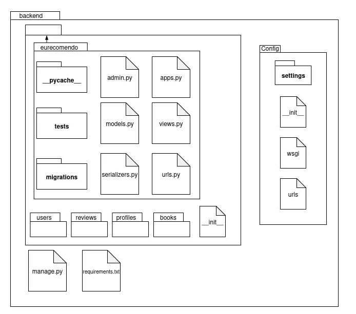
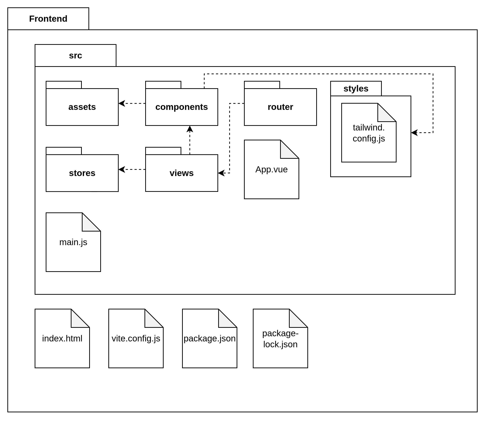

# Visão Lógica

A visão lógica define a arquitetura do software, detalhando seus componentes, classes e as interações entre eles. Utilizando diagramas de classes e componentes, essa visão oferece um mapa claro de como o código é organizado e como a lógica de negócio é implementada, sendo um guia fundamental para a equipe de desenvolvimento.

## Objetivo

O objetivo da visão lógica é traduzir os requisitos funcionais do sistema em uma estrutura tangível. No contexto do projeto **EuRecomendo**, um sistema de recomendação de livros, a visão lógica decompõe o sistema em módulos, classes e objetos. Diagramas de classes são utilizados para representar visualmente essas estruturas e seus relacionamentos, enquanto pacotes organizam o código de forma coesa. As interfaces definem os contratos de comunicação entre os módulos, e uma documentação rigorosa, aliada a revisões constantes, assegura que a implementação final atenda aos objetivos do projeto e mantenha um alto padrão de qualidade.

## Diagrama de Pacotes

A arquitetura do sistema **EuRecomendo** foi estruturada visando o desacoplamento entre as camadas de apresentação (API) e a lógica de negócio (Backend), utilizando um núcleo compartilhado para garantir a consistência dos dados.

A organização dos pacotes reflete a divisão de responsabilidades do sistema, permitindo o desenvolvimento paralelo entre as equipes e facilitando a manutenção evolutiva.

### Diagramas consolidados (Entrega 02)

<p align="center">
  
</p>
<div align="center"><font size="3">Figura 1 – Diagrama de pacotes do backend reutilizado da Entrega 02 (Modelagem).</font></div>

<p align="center">
  
</p>
<div align="center"><font size="3">Figura 2 – Diagrama de pacotes do frontend reutilizado da Entrega 02.</font></div>

### Detalhamento dos Subsistemas

#### 1. SharedKernel (Núcleo Compartilhado)

O `SharedKernel` atua como a base de contratos do sistema. Ele não possui dependências de outros pacotes, garantindo estabilidade (princípio de arquitetura limpa).

**DTOs (Data Transfer Objects):**
- Define a estrutura dos dados que trafegam entre os clientes e o servidor
- `UserDTO`: Dados de usuário (id, username, email)
- `BookDTO`: Informações de livro (id, title, author, isbn, genre)
- `ReviewDTO`: Dados de avaliação (id, user_id, book_id, rating, comment)
- `ProfileDTO`: Perfil do usuário (bio, preferences, reading_history)
- `RecommendationDTO`: Recomendação gerada (book_id, score, reason)

**Enums:**
- Centraliza as constantes de domínio
- `UserRole`: READER, ADMIN, MODERATOR
- `BookGenre`: FICTION, NON_FICTION, SCIENCE, HISTORY, etc.
- `ReviewStatus`: PENDING, APPROVED, REJECTED
- `ReadingStatus`: TO_READ, READING, READ, ABANDONED

#### 2. Backend (Lógica de Negócio e Orquestração)

O pacote `Backend` concentra a inteligência do sistema. Ele não se comunica diretamente com a interface do usuário, mas expõe serviços para serem consumidos.

**Authentication:**
- `JWTManager`: Geração e validação de tokens JWT
- `PermissionHandler`: Controle de permissões baseado em roles
- `TokenService`: Refresh tokens e revogação

**UserManagement:**
- `UserService`: Lógica de negócio para usuários
- `ProfileService`: Gerenciamento de perfis e preferências
- `UserRepository`: Abstração de acesso a dados de usuários

**BookCatalog:**
- `BookService`: Operações CRUD de livros
- `GenreService`: Gerenciamento de gêneros e categorias
- `BookRepository`: Persistência de livros

**ReviewSystem:**
- `ReviewService`: Criação e moderação de avaliações
- `RatingCalculator`: Cálculo de médias e estatísticas
- `ReviewRepository`: Persistência de reviews

**RecommendationEngine:**
- `CollaborativeFilter`: Filtragem colaborativa (user-based)
- `ContentBasedFilter`: Filtragem baseada em conteúdo
- `HybridRecommender`: Combina ambas abordagens
- `RecommendationService`: Orquestra geração de recomendações

**TaskOrchestrator:**
- `CeleryTasks`: Tarefas assíncronas (geração de recomendações, envio de emails)
- `TaskScheduler`: Agendamento de tarefas periódicas

#### 3. WebAPI (Camada de Apresentação)

**Controllers (ViewSets):**
- Endpoints REST para cada recurso
- Validação de entrada
- Serialização de resposta

**Serializers:**
- Conversão entre modelos Django e JSON
- Validação de dados de entrada
- Campos computados e relacionamentos

**Middleware:**
- `AuthenticationMiddleware`: Validação de JWT
- `RateLimitMiddleware`: Proteção contra abuso
- `LoggingMiddleware`: Auditoria de requisições

## Diagrama de Classes

Esta seção apresenta a estrutura estática do sistema **EuRecomendo**, detalhando as classes, seus atributos e os relacionamentos estabelecidos para atender aos requisitos funcionais e regras de negócio.

### Visualização Geral

<p align="center">
  
</p>
<div align="center"><font size="3">Figura 3 – Diagrama de Classes reutilizado da Entrega 02, alinhado aos modelos Django planejados.</font></div>

### Detalhamento das Classes Significativas

#### 1. Núcleo de Usuários

**User (Usuário)**

```python
class User:
    # Atributos
    - id: UUID
    - username: String
    - email: String
    - password_hash: String
    - is_active: Boolean
    - is_staff: Boolean
    - date_joined: DateTime
    - last_login: DateTime
    
    # Métodos
    + authenticate(password: String): Boolean
    + update_profile(data: Dict): Profile
    + get_reading_history(): List[Book]
    + get_recommendations(): List[Recommendation]
    + create_review(book_id: UUID, rating: Int, comment: String): Review
```

**Responsabilidade:** Classe base que representa um usuário do sistema, contendo credenciais de acesso e dados pessoais básicos necessários para autenticação.

**Profile (Perfil)**

```python
class Profile:
    # Atributos
    - id: UUID
    - user_id: UUID (FK -> User)
    - bio: Text
    - favorite_genres: List[BookGenre]
    - reading_preferences: JSON
    - avatar_url: String
    - created_at: DateTime
    - updated_at: DateTime
    
    # Métodos
    + update_preferences(preferences: Dict): void
    + add_favorite_genre(genre: BookGenre): void
    + remove_favorite_genre(genre: BookGenre): void
    + get_reading_statistics(): Dict
```

**Responsabilidade:** Representa o perfil estendido do usuário com preferências de leitura e configurações personalizadas.

**Relacionamento:** User 1:1 Profile (One-to-One)

#### 2. Núcleo de Livros e Catálogo

**Book (Livro)**

```python
class Book:
    # Atributos
    - id: UUID
    - title: String
    - author: String
    - isbn: String (unique)
    - genre: BookGenre
    - publication_year: Integer
    - synopsis: Text
    - cover_image_url: String
    - average_rating: Decimal
    - total_reviews: Integer
    - created_at: DateTime
    - updated_at: DateTime
    
    # Métodos
    + get_average_rating(): Decimal
    + get_reviews(): List[Review]
    + get_similar_books(): List[Book]
    + update_rating_statistics(): void
```

**Responsabilidade:** Representa a unidade mínima do catálogo (livro), contendo metadados, descrição e estatísticas de avaliação.

#### 3. Sistema de Avaliações

**Review (Avaliação)**

```python
class Review:
    # Atributos
    - id: UUID
    - user_id: UUID (FK -> User)
    - book_id: UUID (FK -> Book)
    - rating: Integer (1-5)
    - comment: Text
    - status: ReviewStatus
    - helpful_count: Integer
    - created_at: DateTime
    - updated_at: DateTime
    
    # Métodos
    + validate_rating(): Boolean
    + update_comment(new_comment: String): void
    + mark_as_helpful(user_id: UUID): void
    + moderate(status: ReviewStatus): void
```

**Responsabilidade:** Entidade que representa uma avaliação de livro feita por um usuário, incluindo nota e comentário.

**Relacionamentos:**
- User 1:N Review (One-to-Many)
- Book 1:N Review (One-to-Many)

#### 4. Motor de Recomendação

**Recommendation (Recomendação)**

```python
class Recommendation:
    # Atributos
    - id: UUID
    - user_id: UUID (FK -> User)
    - book_id: UUID (FK -> Book)
    - score: Decimal (0.0-1.0)
    - algorithm_used: String
    - explanation: Text
    - is_viewed: Boolean
    - created_at: DateTime
    - expires_at: DateTime
    
    # Métodos
    + calculate_score(): Decimal
    + get_explanation(): String
    + mark_as_viewed(): void
    + is_expired(): Boolean
```

**Responsabilidade:** Representa uma recomendação gerada pelo sistema para um usuário específico.

**Relacionamentos:**
- User 1:N Recommendation (One-to-Many)
- Book 1:N Recommendation (One-to-Many)

#### 5. Biblioteca Pessoal

**UserLibrary (Biblioteca do Usuário)**

```python
class UserLibrary:
    # Atributos
    - id: UUID
    - user_id: UUID (FK -> User)
    - book_id: UUID (FK -> Book)
    - status: ReadingStatus
    - progress_percentage: Integer (0-100)
    - started_at: DateTime
    - finished_at: DateTime
    - notes: Text
    
    # Métodos
    + update_progress(percentage: Integer): void
    + mark_as_read(): void
    + add_note(note: String): void
    + get_reading_time(): TimeDelta
```

**Responsabilidade:** Gerencia a relação entre usuários e livros em suas bibliotecas pessoais.

**Relacionamentos:**
- User 1:N UserLibrary (One-to-Many)
- Book 1:N UserLibrary (One-to-Many)

## Padrões de Projeto Aplicados

### 1. Repository Pattern

**Contexto:** Abstração de acesso a dados

```python
class BookRepository:
    def get_by_id(book_id: UUID) -> Book
    def get_all() -> List[Book]
    def create(book_data: Dict) -> Book
    def update(book_id: UUID, data: Dict) -> Book
    def delete(book_id: UUID) -> void
    def find_by_genre(genre: BookGenre) -> List[Book]
```

**Benefício:** Desacopla lógica de negócio da persistência

### 2. Service Layer Pattern

**Contexto:** Encapsulamento de lógica de negócio

```python
class RecommendationService:
    def __init__(self, 
                 collaborative_filter: CollaborativeFilter,
                 content_filter: ContentBasedFilter,
                 repository: RecommendationRepository):
        self.collaborative = collaborative_filter
        self.content = content_filter
        self.repository = repository
    
    def generate_recommendations(user_id: UUID) -> List[Recommendation]:
        # Orquestra diferentes algoritmos
        collab_recs = self.collaborative.recommend(user_id)
        content_recs = self.content.recommend(user_id)
        return self._merge_and_rank(collab_recs, content_recs)
```

**Benefício:** Centraliza lógica de negócio complexa

### 3. Strategy Pattern

**Contexto:** Algoritmos de recomendação intercambiáveis

```python
class RecommendationStrategy(ABC):
    @abstractmethod
    def recommend(user_id: UUID) -> List[Book]:
        pass

class CollaborativeFilter(RecommendationStrategy):
    def recommend(user_id: UUID) -> List[Book]:
        # Implementação de filtragem colaborativa
        pass

class ContentBasedFilter(RecommendationStrategy):
    def recommend(user_id: UUID) -> List[Book]:
        # Implementação baseada em conteúdo
        pass
```

**Benefício:** Facilita adição de novos algoritmos

### 4. Factory Method Pattern

**Contexto:** Criação de diferentes tipos de recomendadores

```python
class RecommenderFactory:
    @staticmethod
    def create_recommender(algorithm_type: String) -> RecommendationStrategy:
        if algorithm_type == "collaborative":
            return CollaborativeFilter()
        elif algorithm_type == "content":
            return ContentBasedFilter()
        elif algorithm_type == "hybrid":
            return HybridRecommender()
        else:
            raise ValueError(f"Unknown algorithm: {algorithm_type}")
```

**Benefício:** Centraliza lógica de criação de objetos

### 5. Observer Pattern

**Contexto:** Notificações de novas recomendações

```python
class RecommendationObserver(ABC):
    @abstractmethod
    def update(recommendation: Recommendation):
        pass

class EmailNotifier(RecommendationObserver):
    def update(recommendation: Recommendation):
        # Envia email ao usuário
        pass

class PushNotifier(RecommendationObserver):
    def update(recommendation: Recommendation):
        # Envia notificação push
        pass
```

**Benefício:** Desacopla geração de recomendações de notificações

## Mapeamento para Django

### Correspondência Arquitetura → Implementação

| Componente Arquitetural | Implementação Django |
|------------------------|---------------------|
| User | `users.models.User` (extends AbstractUser) |
| Profile | `profiles.models.Profile` |
| Book | `books.models.Book` |
| Review | `reviews.models.Review` |
| Recommendation | `recommender.models.Recommendation` |
| UserLibrary | `profiles.models.UserLibrary` |
| UserService | `users.services.UserService` |
| BookService | `books.services.BookService` |
| RecommendationEngine | `recommender.engine.RecommendationEngine` |
| UserController | `users.views.UserViewSet` |
| BookController | `books.views.BookViewSet` |

## Quadro de Participações

| **Membro da equipe** | **Função** |
| :------------- | :--------- |
| Pedro Braga | Documentação da Visão Lógica |

## Referências

> 1. UNIVERSIDADE DE BRASÍLIA (UnB). Arquitetura e Desenho de Software - Aula Arquitetura e DAS - Parte II. Disponível em: Aprender3. Acesso em: 21/11/2025.
> 3. FOWLER, Martin. Patterns of Enterprise Application Architecture. Addison-Wesley, 2002.
> 4. Django Documentation. Models. Disponível em: https://docs.djangoproject.com/en/4.2/topics/db/models/. Acesso em: 21/11/2025.

## Histórico de Versões

| **Data**       | **Versão** | **Descrição**                         | **Autor**                                      | **Revisor**                                      | **Data da Revisão** |
| :--------: | :----: | :-------------------------------- | :----------------------------------------: | :----------------------------------------: | :-------------: |
| 21/11/2025 |  `1.0`   | Criação da Visão Lógica com diagramas de pacotes e classes | Pedro Braga ([@Stain19](https://github.com/Stain19)) | - |   -    |
