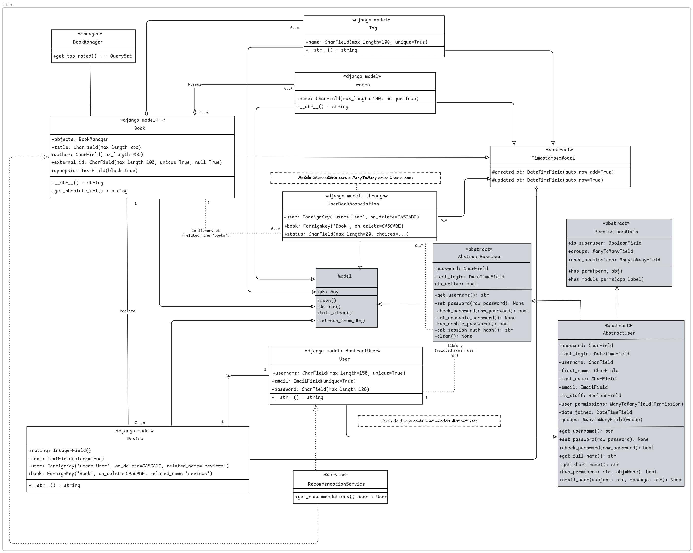
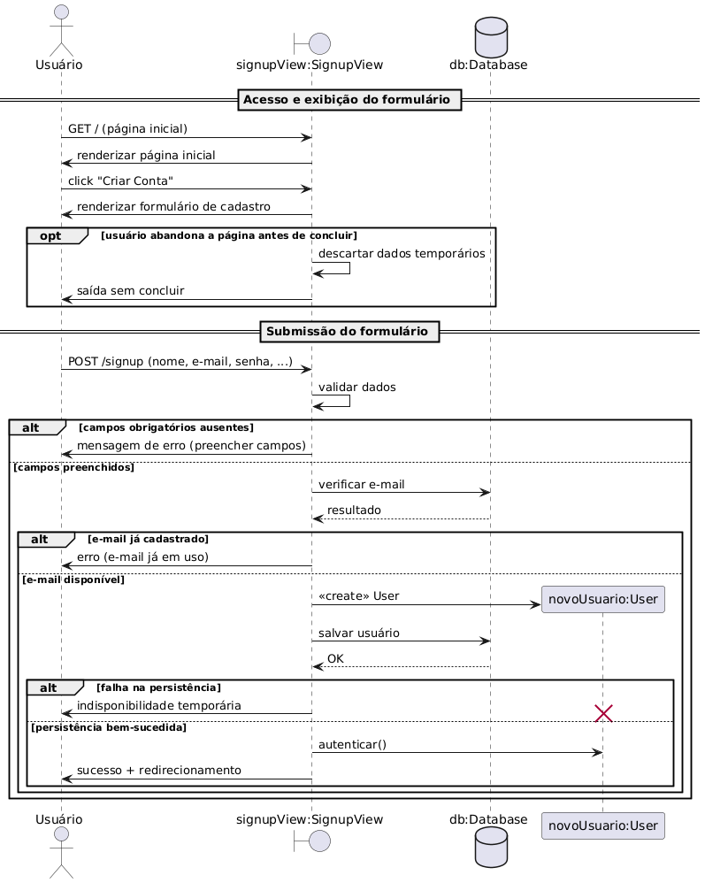

# Assets - Diagramas e Imagens

Esta pasta contém todos os diagramas e imagens utilizados na documentação do projeto EuRecomendo.

## Estrutura de Diretórios

```
assets/
├── diagrama-de-pacotes/
│   └── (Diagramas de pacotes do sistema)
├── diagrama-de-classes/
│   └── (Diagramas de classes do domínio)
├── diagrama-de-sequencia/
│   └── (Diagramas de sequência dos fluxos)
├── diagrama-de-atividades/
│   └── (Diagramas de atividades dos processos)
├── diagrama-de-estados/
│   └── (Diagramas de estados das entidades)
├── diagrama-de-casos-de-uso/
│   └── (Diagramas de casos de uso)
├── diagrama-de-implantacao/
│   └── (Diagramas de implantação)
├── padroes-gof/
│   └── (Diagramas de padrões de projeto)
└── outros/
    └── (Outros recursos visuais)
```

## Assets importados das entregas anteriores

- **Entrega 01**: `outros/rich-picture.png` e `outros/storyboard.png`
- **Entrega 02**: Diagramas de pacotes, classes, casos de uso, atividades, sequência e implantação
- **Entrega 03**: Diagramas de padrões GoF (Adapter, Builder, Iterator)

## Ferramentas Recomendadas

### Para Criação de Diagramas UML

1. **Lucidchart** (https://www.lucidchart.com/)
   - Interface intuitiva
   - Colaboração em tempo real
   - Templates UML prontos

2. **Draw.io / diagrams.net** (https://app.diagrams.net/)
   - Gratuito e open source
   - Integração com Google Drive/GitHub
   - Exportação em múltiplos formatos

3. **PlantUML** (https://plantuml.com/)
   - Diagramas como código
   - Versionamento fácil
   - Integração com IDEs

4. **StarUML** (https://staruml.io/)
   - Ferramenta profissional
   - Suporte completo a UML 2.x
   - Geração de código

### Para Diagramas de Arquitetura

1. **Mermaid** (https://mermaid.js.org/)
   - Markdown-based
   - Integração com GitHub
   - Diagramas de sequência, fluxo, etc.

2. **Excalidraw** (https://excalidraw.com/)
   - Estilo hand-drawn
   - Colaboração em tempo real
   - Exportação PNG/SVG

## Convenções de Nomenclatura

### Arquivos de Diagrama

- Use nomes descritivos em kebab-case
- Inclua o tipo de diagrama no nome
- Exemplos:
  - `diagrama-classes-recomendacao.png`
  - `diagrama-sequencia-criar-review.svg`
  - `diagrama-implantacao-producao.png`

### Formato de Arquivos

- **Preferencial**: SVG (escalável, menor tamanho)
- **Alternativo**: PNG (alta resolução, mínimo 1920px de largura)
- **Evitar**: JPG (perda de qualidade em diagramas)

## Checklist para Adicionar Diagramas

- [ ] Diagrama criado com ferramenta adequada
- [ ] Legenda incluída (se necessário)
- [ ] Texto legível (fonte mínima 12pt)
- [ ] Cores acessíveis (contraste adequado)
- [ ] Arquivo otimizado (tamanho < 500KB)
- [ ] Nome descritivo e padronizado
- [ ] Referenciado na documentação markdown
- [ ] Versionado no Git

## Exemplos de Referência

### No Markdown

```markdown

<center>Figura 1: Diagrama de Classes do Domínio</center>
<center>Fonte: Equipe EuRecomendo (2025)</center>
```

### Com Link Clicável

```markdown
<p align="center">
  
</p>
<div align="center">
  <font size="3">Figura 2 – Diagrama de Sequência: Criar Review</font>
</div>
```

## Direitos e Atribuições

Todos os diagramas e imagens nesta pasta são de autoria da equipe EuRecomendo, criados especificamente para o projeto de Arquitetura e Desenho de Software da UnB, 2025.2.

**Licença**: Uso educacional e acadêmico.

## Contribuindo com Assets

1. Crie o diagrama usando uma das ferramentas recomendadas
2. Exporte em formato SVG ou PNG de alta qualidade
3. Salve no diretório apropriado
4. Adicione referência na documentação
5. Commit com mensagem descritiva: `docs: add diagrama de [tipo]`

## Contato

Para dúvidas sobre assets e diagramas, consulte a equipe do projeto.
